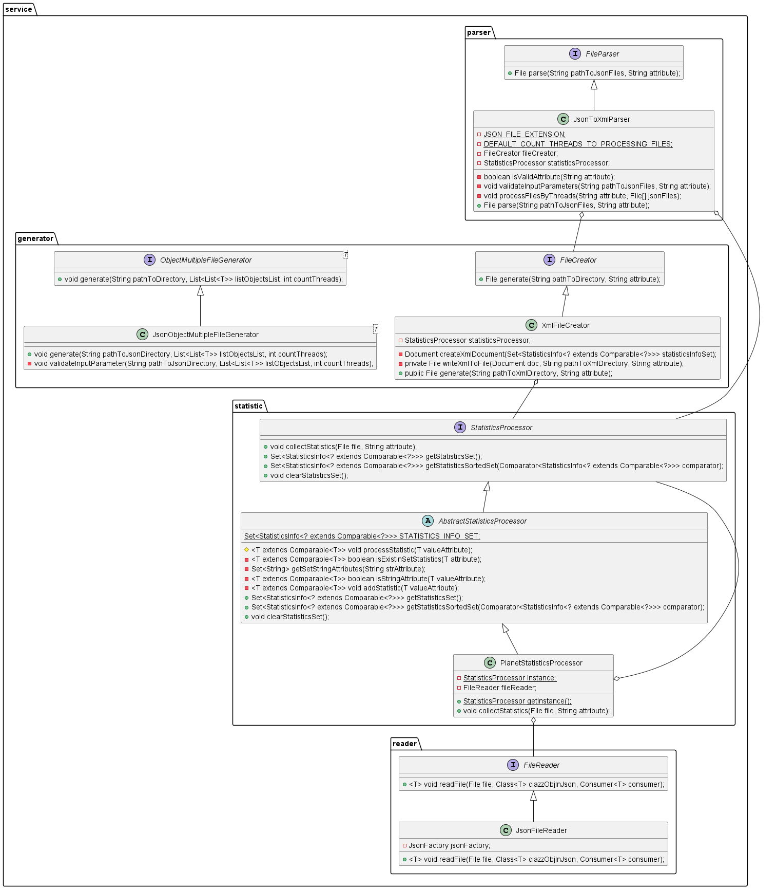

# Java Core Parser


> ## The short description of the project:
> - A console script program that <b>parses the list of JSON files</b> of
> the main entity and <b>generates statistics (the total number) in terms of one of its attributes</b>.
> - As launch parameters, it receives the path to the folder where the JSON files
> are stored (there may be several of them there) and the name of the attribute on which to generate statistics.
> - The program must <b>support work with several attributes</b>, and the user will specify one of them.
> - One of the attributes must be text and have several values (comma categories, hash tags, etc.).
> - As a result of the work, the program creates an XML file with statistics sorted by number
> from the largest to the smallest.
> - The name of the result file will be `statistics_by_{attribute}.xml`.

---

## List of Contents

- [Project Structure](#project-structure)
- [Usage](#usage)
- [Description of domain entities](#description-of-domain-entities)
- [Description of services](#description-of-services)
- [Input and output examples files](#input-and-output-examples-files)
- [Results of testing parsing with different count of threads](#results-of-testing-parsing-with-different-count-of-threads)
- [Author Info](#author-info)

---

## Project Structure

- The application consists of ui, service layers.
- An app modules:
    - `model`: contains the data model classes used throughout the application.
      These classes represent the core entities the application.
    - `service`: encapsulates the business logic of the application.
      This includes functionalities such as data processing, calculations.
    - `ui`: handles the user interface aspects of the application.

## Usage

1. I would you recommended to clone my project from the GitHub.
   <br> If you want to do this, please use this command:

```md  
git clone https://github.com/dima666Sik/ProfITsoft-Internship.git
```

2. To run this project, you will need to install:
    - JDK 17 or higher;
3. Then you can check performance program **by using junit tests**;
4. Also, you can start working with app **using `Main` class**, start main method;
   If you decide to start an app using `Main` class, you should use the console to write commands by using them u will
   be able to use the features' app;
5. The JSON file(s) will be automatically generated using `first case` when you start application and chose first case. <br>
   The path to the JSON file(s) is: `src/main/resources/json-files`;
6. The result working `second case` app to parse the JSON file(s) you can see in the `src/main/resources/xml-files`
   directory.

---

## Description of domain entities

In this description you will see info about three main domain entities:

1. `Planet`: represents a celestial body in space, a class used to generate JSON files and statistics.
    - Attributes:
        - `id`: Unique identifier for the planet.
        - `name`: Name of the planet.
        - `mass`: Mass of the planet, represented by an instance of Mass.
        - `diameter`: Diameter of the planet, represented by an instance of Diameter.
        - `hasRings`: Indicates whether the planet has rings.
        - `hasMoons`: Indicates whether the planet has moons.
        - `atmosphericComposition`: Composition of the planet's atmosphere.
        - `planetarySystem`: The planetary system to which the planet belongs.

2. `PlanetarySystem`: represents a system of celestial bodies, typically containing one or more planets.
    - Attributes:
        - `id`: Unique identifier for the planetary system.
        - `name`: Name of the planetary system.

3. `StatisticsInfo`: represents statistical information about a Planets by attribute.
    - Attributes:
        - `attribute`: The attribute being analyzed. This have `T` type that extends `Comparable<T>`
        - `numberOfRepetitions`: The number of times the attribute has been observed.

### Designed domain diagram


## Description of services

In this description you will see info about four models in `service` (described only implementations):

- `generator` - This module contains two classes that are implementation of interfaces:
    - ***JsonObjectMultipleFileGenerator***  is a class that implements the **ObjectMultipleFileGenerator** interface.
      It
      provides functionality to generate multiple JSON files from lists of objects.
    - ***XmlFileCreator*** is a class that implements the **FileCreator** interface and provides functionality to
      generate
      XML files based on statistics collected from JSON data.
- `parser` - The module contains class that is implementation of the **FileParser** interface.
    - ***JsonToXmlParser*** is a class that implements the **FileParser** interface and provides functionality to parse
      JSON files into file with XML format that contains statistics info by indicated attribute. It processes JSON files
      from a specified directory, converts them into XML file, and saves it to a default location.
- `reader` - The module contains class that is implementation of the **FileReader** interface.
    - ***JsonFileReader*** is a class that uses Jackson to parse and deserialize objects from a JSON file. Reading the
      JSON file will be by small parts for height performance because we avoid reading the entire JSON file, so we won't
      see **OutOfMemoryError** if the file(s) is large.
- `statistic` - The module contains the abstract class and interface that are implemented by
  **PlanetStatisticProcessor**.
    - ***AbstractStatisticsProcessor*** is an abstract class that provides common functionality for processing
      statistics. It implements the **StatisticsProcessor** interface and provides methods to collect and manage
      statistics
      information. Subclasses can extend this class to implement specific logic for processing statistics related to
      different data types.
    - ***PlanetStatisticsProcessor*** is a class that extends AbstractStatisticsProcessor and implements the
      StatisticsProcessor interface that provides functionality to collect statistics from JSON data related to planets.
      It processes JSON files, extracts specified attributes, and collects statistics on them.

### Designed architecture diagram



### Patterns

Patterns were used into this project:

- Singleton pattern
- Facade pattern
- Builder pattern

### SOLID

Into this project I tried to adhere to all of these principles.

## Input and output examples files

For example, our subject area is about Planet, then the format can be as follows:

```json
[
  {
    "id": 1,
    "name": "Planet530",
    "mass": {
      "value": 9.398156073270247,
      "unit": "KILOGRAM"
    },
    "diameter": {
      "value": 7136.0,
      "unit": "KILOMETER"
    },
    "hasRings": true,
    "hasMoons": true,
    "atmosphericComposition": "Oxygen, Nitrogen, Carbon dioxide",
    "planetarySystem": {
      "id": 1,
      "name": "Planetary System X1"
    }
  },
  ...
  {
    "id": 7,
    "name": "Planet401",
    "mass": {
      "value": 4.927016280930118,
      "unit": "KILOGRAM"
    },
    "diameter": {
      "value": 9502.0,
      "unit": "KILOMETER"
    },
    "hasRings": true,
    "hasMoons": false,
    "atmosphericComposition": "Nitrogen, Carbon dioxide",
    "planetarySystem": {
      "id": 1,
      "name": "Planetary System X1"
    }
  }
]
```

> If you want to change the subject area you can add a new implementation **StatisticsProcessor**
> and add a class with constants by new subject area.

At the result of the parsing we will receive this statistics info (for example we decide to use `atmosphericComposition`
attribute):

```xml
<?xml version="1.0" encoding="UTF-8" standalone="no"?>
<statistics>
    <item>
        <value>Nitrogen</value>
        <count>17</count>
    </item>
    <item>
        <value>Carbon dioxide</value>
        <count>13</count>
    </item>
    <item>
        <value>Oxygen</value>
        <count>8</count>
    </item>
    <item>
        <value>Helium</value>
        <count>4</count>
    </item>
    <item>
        <value>Hydrogen</value>
        <count>4</count>
    </item>
    <item>
        <value>Beryllium</value>
        <count>3</count>
    </item>
    <item>
        <value>Magnesium</value>
        <count>1</count>
    </item>
</statistics>
```

Also, if you want you can generate statistics using another attribute, for example `id` Planet

```xml
<?xml version="1.0" encoding="UTF-8" standalone="no"?>
<statistics>
    <item>
        <value>5</value>
        <count>3</count>
    </item>
    <item>
        <value>6</value>
        <count>3</count>
    </item>
    <!--... skip tags ...-->
    <item>
        <value>12</value>
        <count>1</count>
    </item>
</statistics>
```

## Results of testing parsing with different count of threads (processing three files)

1. Test parsing with **one** thread to processing multiple JSON files take 0.250 seconds
2. Test parsing with **two** threads to processing multiple JSON files take 0.201 seconds
3. Test parsing with **four** threads to processing multiple JSON files take 0.184 seconds
4. Test parsing with **eighth** threads to processing multiple JSON files take 0.189 seconds

For assume time parsing files, I was created the `ua.code.intership.proft.it.soft.service.util.TimeChecker`.

### ***Explain results***

The number of JSON files in the directory is three.
<br>So if we have less than three threads to process files, the program will process files with free threads and if
there are not enough app will wait for free threads to process other files that remain, it will take more time.
<br>Otherwise, the threads will exist but not be used, so time work in that case won't be shorter.
<br>The better way is when several threads == number of files, so each file is processed in a separate thread and doesn't wait
for free threads, or we haven't taken memory and don't use useless threads.
<br>However, the efficiency will also depend on the number of available processor cores and the volume of processed
files.

## Author Info

- [Linkedin](https://www.linkedin.com/in/dmytro-kohol-333a7a2aa/)

- [My GitHub](https://github.com/dima666Sik)

- [ProfITsoft-Internship repository](https://github.com/dima666Sik/ProfITsoft-Internship)

[Back To The Top](#usage)