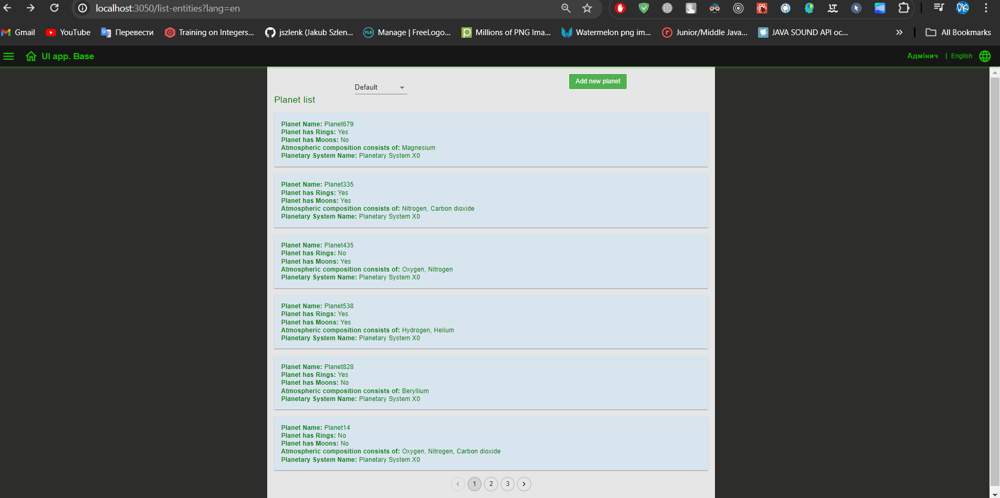

# React-Redux Application

## List of Contents

- [The short description of the project](#the-short-description-of-the-project)
- [The result of the project](#the-result-of-the-project)

## The short description of the project
Create an app based on the `ui-base-app-next` template to manage the entities used in your domain.

- Add 2 new pages: "Entity List" and "Entity Details".
- On the first page, display a list of entities with basic fields. Add ability to delete entities with confirmation and notification of successful deletion.
- Add the ability to navigate to the details of an entity when clicking on it in the list.
- For the convenience of the user, add the button "Add an entity" and the functionality of filtering and pagination.
- On the second page, display the entity information in view and edit modes.
- Validate fields before saving with the ability to undo changes.
- Add a back button to return to the entity list while preserving the filter and pagination.

## The result of the project
### The Planet List
#### The Planet List Ukraine

#### The Planet List English

#### The Filter & Pagination & Delete Item

### The Planet Detail
#### The Planet Detail

#### The Planet Detail Edit

#### Planet Detail Create

